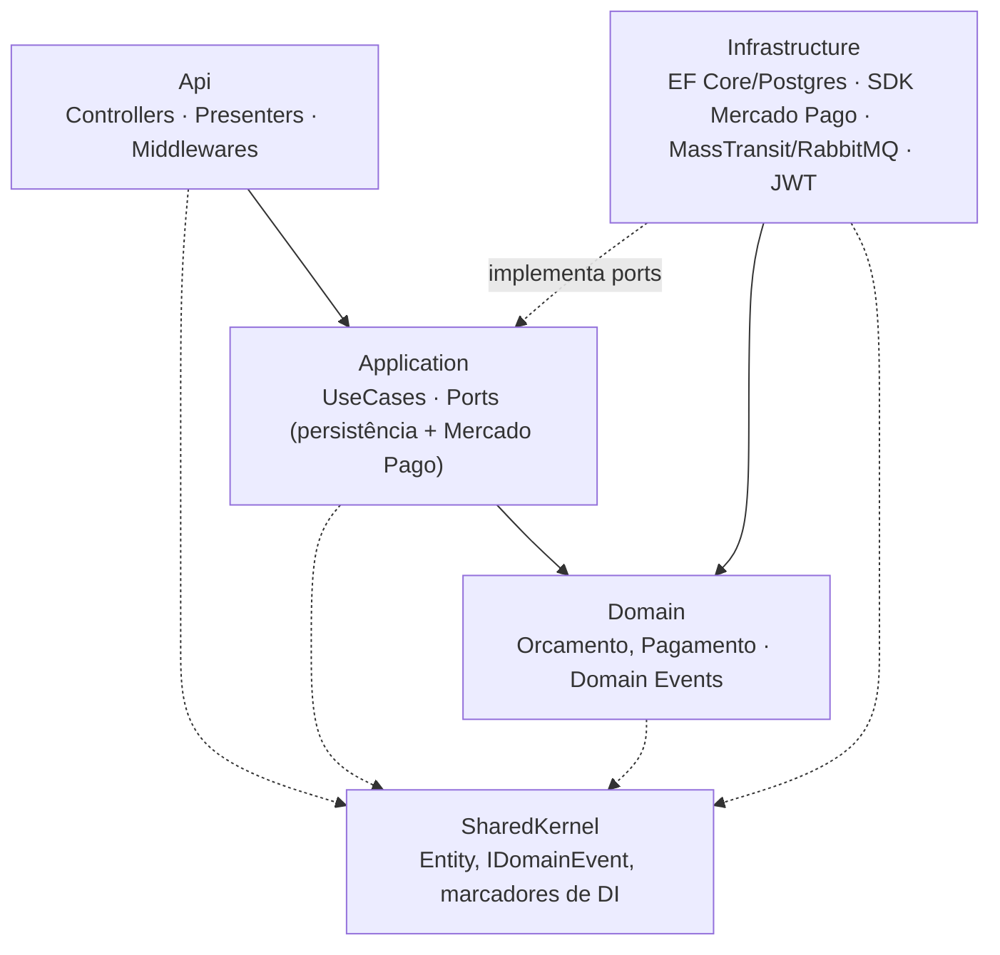
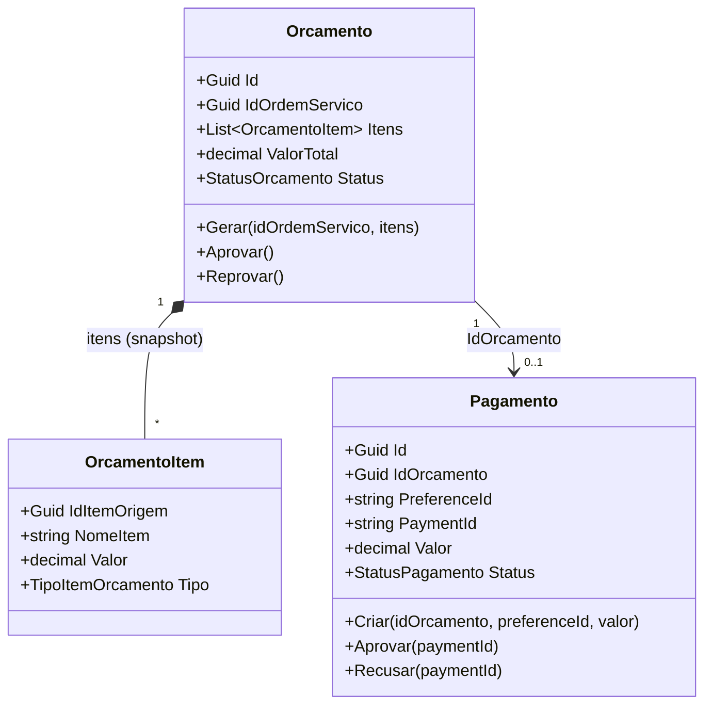
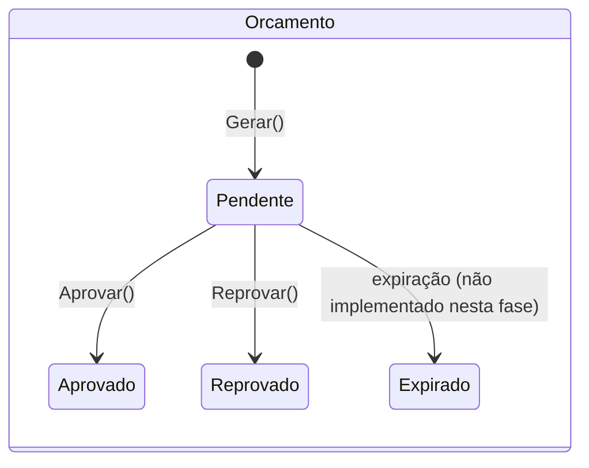
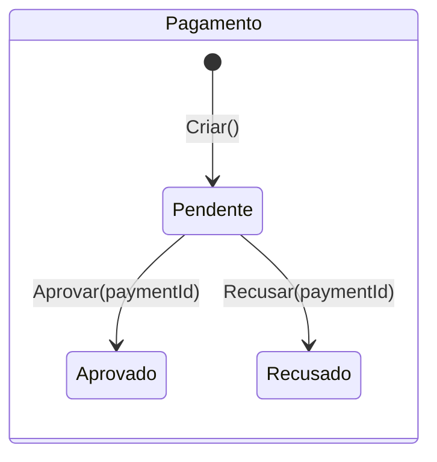
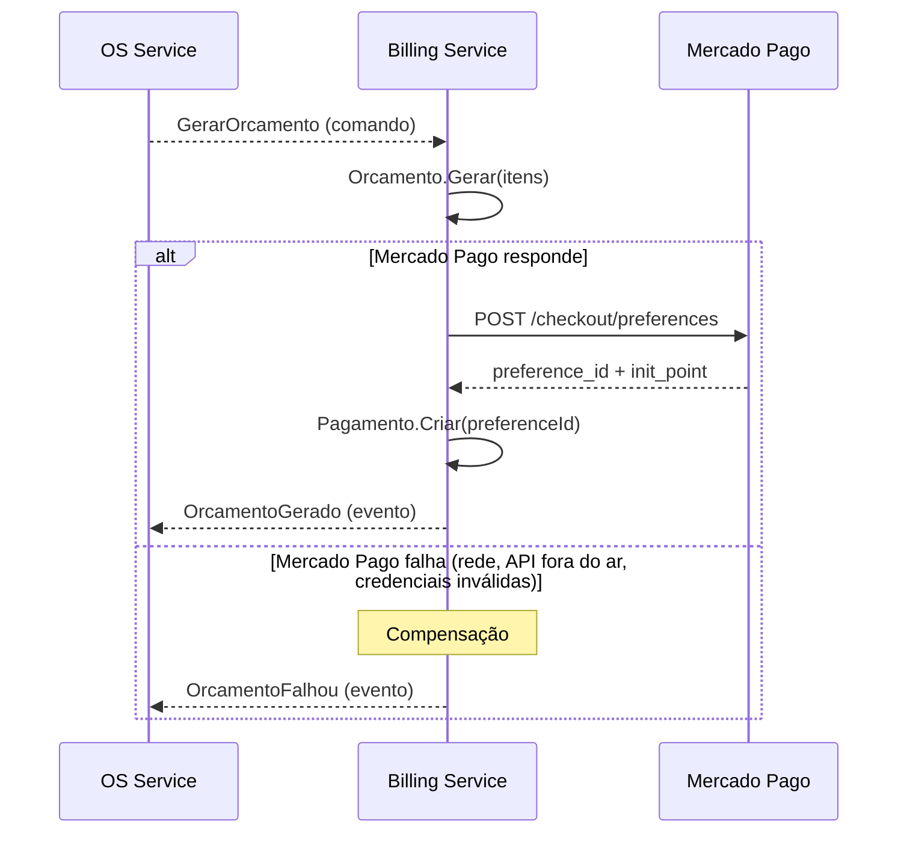
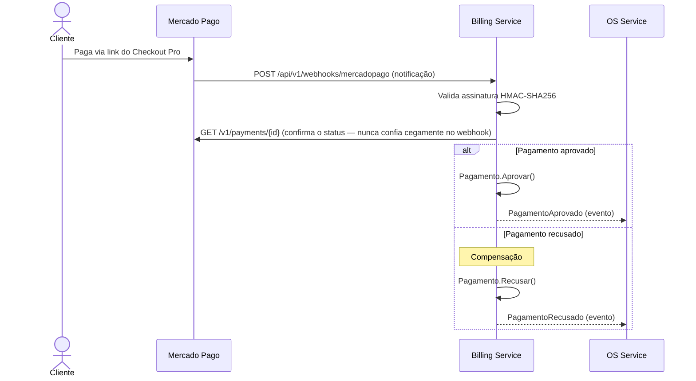

# Arquitetura — Billing Service

Documento complementar ao [README](../README.md), com mais profundidade sobre camadas,
modelo de domínio e a integração com o Mercado Pago. Justificativa do desenho da saga
como um todo (por que a orquestração vive no OS Service): [ADR 0001 no repositório do
OS Service](https://github.com/monnclaro/soat-tech-challenge-os-service/blob/main/docs/adr/0001-saga-orquestrada-sem-state-machine-separado.md).

## Camadas (Clean Architecture)

Regra de dependência garantida por testes de arquitetura (NetArchTest,
`tests/Tests/Camadas`) — `Infrastructure` nunca é referenciada por `Application`/`Domain`.

## Modelo de domínio

`OrcamentoItem` é um **snapshot** (nome/valor/tipo congelados no momento da geração)
— mesmo padrão usado no monolito de origem para `OrdemServicoServico`/`OrdemServicoProduto`:
o orçamento não deve mudar se o catálogo (preço de um serviço, por exemplo) mudar depois.

### Máquinas de estado

## Fluxo — geração de orçamento e pagamento

### Idempotência de `GerarOrcamentoUseCase`

Três ramos, cobertos explicitamente em `GerarOrcamentoUseCaseTests`:

1. **Orçamento não existe** → cria Orcamento + chama Mercado Pago + cria Pagamento + publica `OrcamentoGerado`.
2. **Orçamento existe E Pagamento existe** → reentrega da mensagem já processada, curto-circuita como duplicado (`OrcamentoJaExiste`).
3. **Orçamento existe mas Pagamento não existe** → uma tentativa anterior salvou o Orçamento e falhou antes de concluir a integração com o Mercado Pago; retoma a partir daqui em vez de recriar o Orçamento ou tratar como duplicado.

Se a chamada ao Mercado Pago falhar (incluindo numa retomada do ramo 3), o use case
publica `OrcamentoFalhou` — ver "Fluxo — geração de orçamento" acima.

## Mensageria — comandos e consumers

| Mensagem | Tipo | Direção | Consumer/Handler |
|---|---|---|---|
| `GerarOrcamento` | Comando | OS → Billing | `GerarOrcamentoConsumer` |
| `OrcamentoGerado` | Evento | Billing → OS | — |
| `OrcamentoFalhou` | Evento (compensação) | Billing → OS | — |
| `PagamentoAprovado` | Evento | Billing → OS | — |
| `PagamentoRecusado` | Evento (compensação) | Billing → OS | — |

Publishers em `Infrastructure/Messaging/MassTransitSagaEventPublisher.cs`; contratos
compartilhados (cópia idêntica nos 3 repos) em `Application/Messaging/Contracts/SagaContracts.cs`.

## Persistência

PostgreSQL via EF Core, banco lógico `soat_billing` isolado (ver README > "Banco de
dados"). Migração inicial em `src/Infrastructure/Database/Migrations`.

## Segurança

Nunca emite JWT — valida o Bearer com o mesmo segredo simétrico do OS Service. O
webhook do Mercado Pago (`POST /api/v1/webhooks/mercadopago`) é a única rota
`[AllowAnonymous]`: autentica via assinatura HMAC, não via Bearer.
